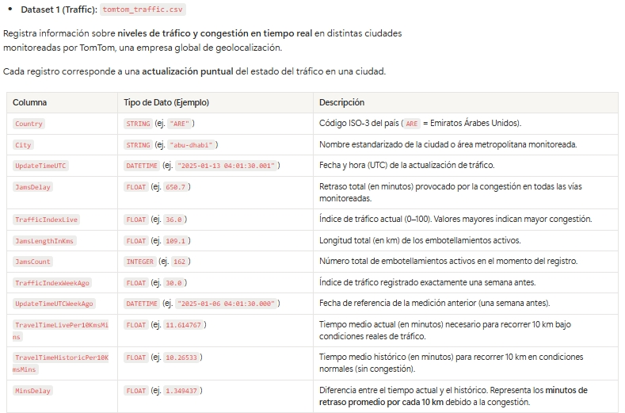
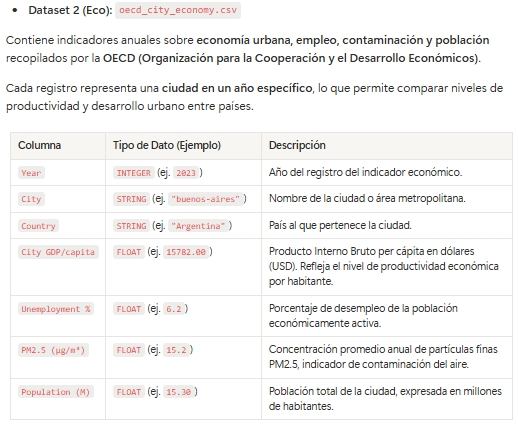
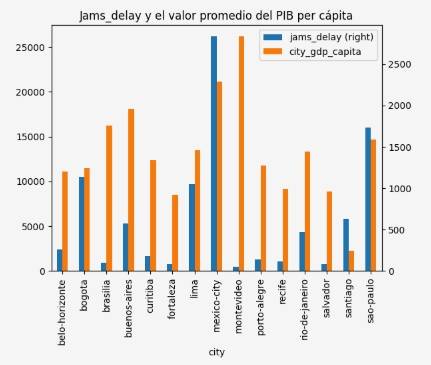
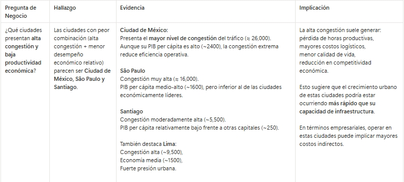
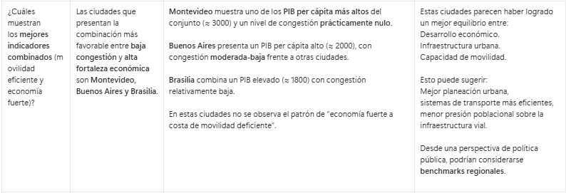
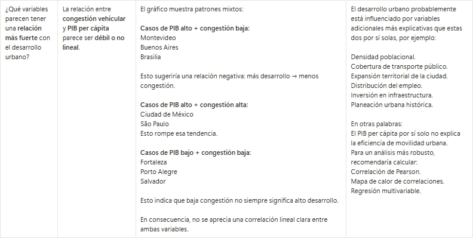

# Movilidad-y-Economia
El objetivo fue identificar en qué ciudades invertir en infraestructura de transporte para mejorar la productividad y el bienestar de la población. Para ello, utilicé las herramientas Jupyter Notebook / Python / pandas / matplotlib / Numpy / seaborn.

Esto me permitió limpiar datos, hacer visualizaciones, comparar ciudades con indicadores específicos como calcular promedios de tráfico por ciudad. 

Como resultado, se analizaron 15 ciudades en 7 países latinoamericanos, de los cuales se debe priorizar inversiones en infraestructura de movilidad en ciudades con mayor congestión en Ciudad de México, São Paulo y Lima.

**Datos:**

**Estructura del proyecto:**

Notebook.ipynb — análisis principal

Tomtom_traffic.csv — datos de tráfico

Oecd_city_economy.csv — datos económicos

**¿Cómo ejecutar el proyecto?**

1. Clona este repositorio o descarga los archivos
2. Abre el archivo `notebook.ipynb` en Jupyter Notebook o Google Colab
3. Ejecuta las celdas en orden de arriba hacia abajo.

![notebook](

**Recomendaciones**

**1. Priorizar inversiones en infraestructura de movilidad en ciudades con mayor congestión.**

Se recomienda enfocar esfuerzos en ciudades como Ciudad de México, São Paulo y Lima, ya que presentan altos niveles de congestión que pueden afectar directamente la productividad urbana. Mejorar la infraestructura vial, optimizar rutas de transporte público e implementar soluciones de movilidad inteligente podría reducir los tiempos de desplazamiento y aumentar la eficiencia económica.

**2. Replicar estrategias exitosas de ciudades con mejor equilibrio entre economía y movilidad.**

Ciudades como Montevideo, Buenos Aires y Brasilia muestran un balance favorable entre baja congestión y alto PIB per cápita. Analizar sus modelos de planificación urbana, cobertura de transporte público e inversión en infraestructura puede ayudar a identificar buenas prácticas que puedan adaptarse a otras ciudades de la región.

**3. Implementar monitoreo continuo mediante KPIs urbanos.**

Dado que la relación entre tráfico y desarrollo económico no es completamente lineal, se recomienda complementar el análisis con indicadores adicionales como densidad poblacional, uso de transporte público y tiempos promedio de desplazamiento. Monitorear estos KPIs de forma periódica mediante dashboards facilitaría la detección temprana de problemas y una toma de decisiones más basada en datos.
